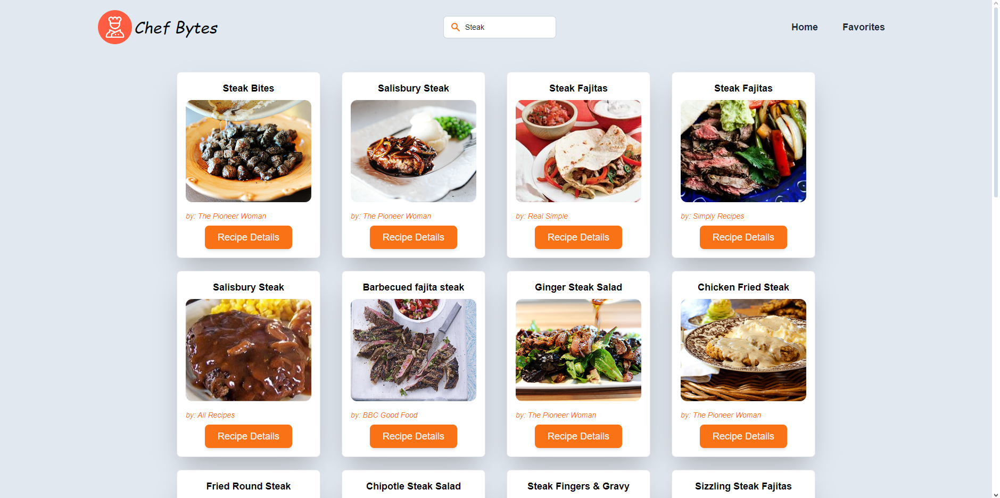

# ReactJS and Tailwind CSS Recipe App 2

## Description

The Recipe App lets users search for recipes instantly as they type. Users can see recipe details, including ingredients, and add recipes to their favorites. They can also view and remove recipes from their favorites list. The app is designed to be fully responsive, ensuring an optimal experience on both mobile and desktop devices.

## Features

- **Instant Search**: Recipes appear as you type.
- **Recipe DetailsView Details**: Click on a recipe to see more info and ingredients.
- **Manage Favorites**: Add and view your favorite recipes.
- **Remove Favorites**: Remove recipes from your favorites list.

## Technologies Used

- **React**: JavaScript library for building user interfaces.
- **Tailwind CSS**: Utility-first CSS framework for styling.
- **Recipe API**: For displaying different recipes.

## Preview

